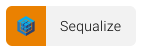
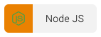

<h1>Welcome To My GitHub</h1>

  Hello everyone, I'm <strong>Fabio Estevez</strong>, a passionate full-stack web & mobile developer with a keen interest in design.

<h2>Social Networks</h2>
<table>
  <tr>
    <td>
      
<a target='_blank' href='https://www.linkedin.com/in/fabio-andres-estevez-herrera/'>LinkedIn</a>

      
<a target='_blank' href='https://www.instagram.com/padermoo/'>Instagram</a>

      
<a target='_blank' href='https://portfolio-fabio.vercel.app/'>Porfolio</a>

    </td>
    <td></td>
    <td></td>
    <td></td>
    <td></td>
    <td>
      
    </td>
  </tr>
</table>

<h2>Frontend</h2>

<h2>Backend</h2>

<h2>Others</h2>

